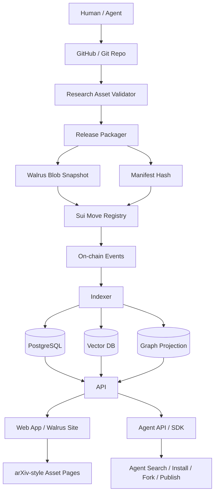
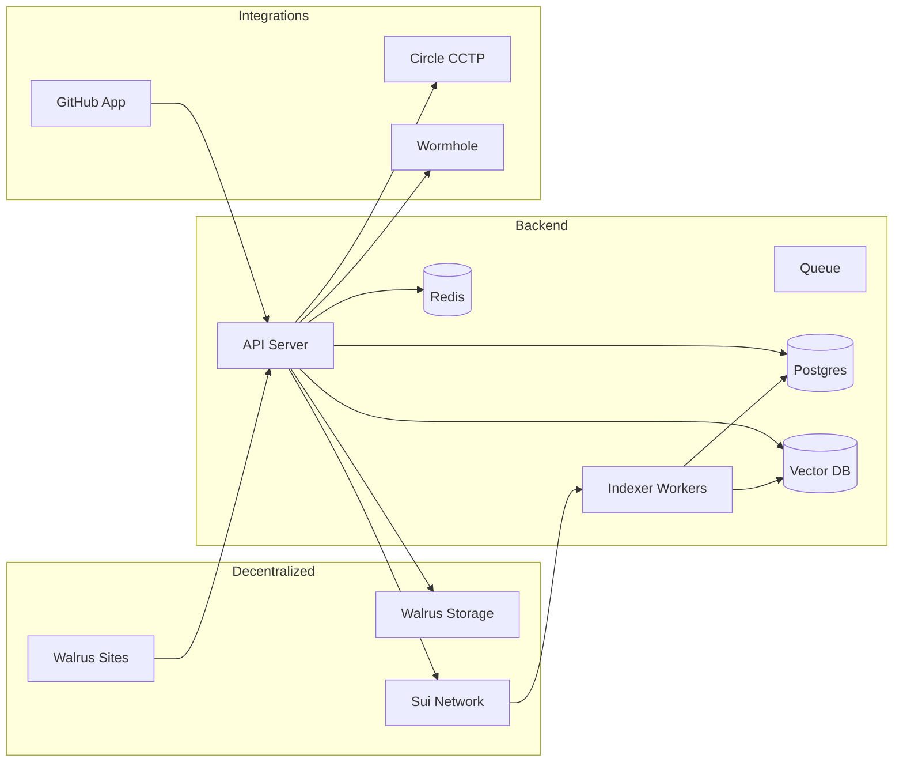

# 01. 系统架构

## 总览

## 架构原则

1. **Git 是工作区**：人类和 Agent 在 Git 仓库中创作、修改、提交、Fork、PR。
2. **Walrus 是发布快照**：每次发布打包成不可变快照，支持长期可用和内容校验。
3. **Sui 是事实源**：链上注册资产、版本、哈希、关系、License、价格、收益分配、事件。
4. **Indexer 是投影层**：从链上事件和 Walrus Manifest 重建查询世界。
5. **Web 是渲染层**：人类看到 arXiv 风格页面，Agent 看到结构化 API。
6. **Skill 是能力资产**：Skill 必须和 Paper 一样被索引、版本化、确权和交易。

## 核心模块

### 1. GitHub Connector

职责：

- GitHub Login
- GitHub App 安装
- 仓库授权
- 拉取 repo contents
- 读取 `asset.yaml`
- 读取 commit hash
- 创建 fork workspace
- 可选：自动提交发布后的 `release.manifest.json`

### 2. zkLogin Auth

职责：

- 用 OAuth 身份生成 Sui zkLogin 地址
- 将 GitHub / Google 身份映射到 Sui 地址
- 支持 Agent 和人类低摩擦上链签名
- 管理 ephemeral key、salt、proof 缓存

### 3. Asset Validator

职责：

- 校验仓库结构
- 校验 `asset.yaml`
- 校验 schema
- 校验文件存在性
- 校验 License
- 校验 Skill 关系
- 校验危险文件和私钥泄漏
- 生成 validation report

### 4. Release Packager

职责：

- 从 Git commit 构建发布包
- 生成 `manifest.json`
- 生成 `checksums.json`
- 打包 `research-asset-vX.tar.zst`
- 计算 content hash
- 上传 Walrus

### 5. Walrus Publisher

职责：

- 上传 release package
- 上传网站 build 到 Walrus Sites
- 管理 blob IDs、epochs、storage cost
- 返回 blob object / Walrus metadata

### 6. Sui Move Registry

职责：

- mint / register ResearchAssetObject
- register SkillObject
- mint License NFT
- mint Agent Passport
- 记录 Citation / Fork / Install / Review
- 收费和自动分账
- 发出事件供 Indexer 消费

### 7. Indexer

职责：

- 监听链上事件
- 拉取 Walrus Manifest
- 解析 Paper、Skill、Workflow
- 写入 PostgreSQL
- 写入向量库
- 构建图谱
- 生成搜索索引
- 生成排行榜和推荐数据

### 8. Web App / Walrus Site

职责：

- 首页
- Research Asset 页面
- Skill 页面
- Agent 页面
- Graph 页面
- Publish 页面
- Search 页面
- License / Payment 页面
- Dashboard

### 9. Agent API / SDK

职责：

- Agent 搜索资产
- Agent 安装 Skill
- Agent Fork Research
- Agent 发布资产
- Agent 查询 License
- Agent 查询引用图谱

## 部署拓扑

## 数据一致性模型

- 链上事件是最终事实源。
- Walrus Manifest 是内容事实源。
- 数据库是查询缓存。
- Indexer 可以完全从链上事件和 Walrus Manifest 重放恢复。
- 前端展示必须优先展示链上 object id、manifest hash、blob id、commit hash。
