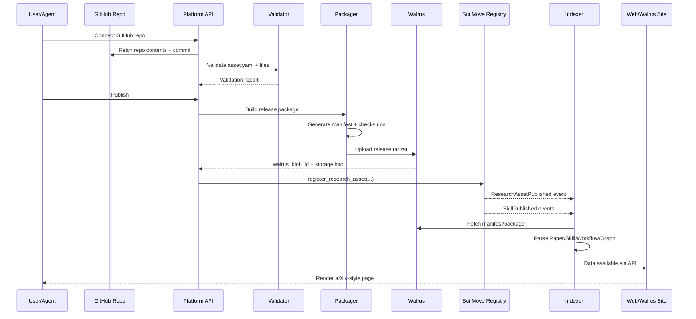

# 03. 发布流程：GitHub → Walrus → Sui → Indexer → Web

## 端到端流程



## 1. Connect Repo

输入：

- GitHub installation id
- repo owner
- repo name
- branch / commit

API 处理：

- 验证 GitHub App installation 权限
- 获取默认分支
- 获取 HEAD commit
- 拉取 `asset.yaml`
- 拉取文件树

输出：

```json
{
  "repo": "owner/name",
  "commit": "abc123",
  "asset_yaml_found": true,
  "validation_status": "pending"
}
```

## 2. Validate

校验：

- YAML 是否可解析
- schema 是否通过
- 文件路径是否存在
- `types` 与目录是否匹配
- Skill 关系是否合法
- `revenue_split` 是否合计 10000 bps
- License 是否完整
- Agent 生成声明是否存在
- PDF 是否可打开
- LaTeX 是否可编译，可选
- 代码是否包含高危命令，可选
- 私钥 / token 是否泄漏

输出：

```json
{
  "valid": true,
  "warnings": [],
  "errors": [],
  "detected_assets": {
    "papers": 1,
    "skills": 2,
    "workflows": 1,
    "datasets": 0
  }
}
```

## 3. Package

生成：

- `manifest.json`
- `checksums.json`
- `release.tar.zst`

`manifest.json` 必须包含：

```json
{
  "schema": "research-asset-manifest/v0.1",
  "repo": "https://github.com/owner/repo",
  "commit": "abc123",
  "asset_yaml_hash": "sha256:...",
  "content_hash": "sha256:...",
  "created_at": "2026-06-10T00:00:00Z",
  "files": [],
  "assets": {},
  "skills": [],
  "relationships": []
}
```

## 4. Upload to Walrus

上传对象：

- 发布包 `release.tar.zst`
- 可选：单独上传 `paper/main.pdf`
- 可选：单独上传 `skill package`
- 可选：前端网站 build 到 Walrus Sites

记录：

- blob id
- object id，如果有
- storage epoch
- size
- content hash

## 5. Register on Sui

调用合约（函数名以 `move/sources/` 已部署实现为准，见 docs/17 裁决 1）：

- `research_asset::publish_research_asset`
- `skill::publish_skill`，每个解析出的 Skill 一次
- `research_asset::cite_asset` / `record_fork`，每条引用/Fork 关系一次
- `revenue::create_revenue_pool`
- `mint_asset_nft`（v2 规划，尚未实现）
- 所有调用 `emit` 事件

参数不存全文，只存：

- manifest hash
- walrus blob id
- repo commit
- asset type
- parent ids
- license id
- price policy id
- revenue pool id

## 6. Indexer

监听事件（完整事件目录与本地/链上差异见 docs/17 裁决 2）：

- `ResearchAssetPublished`
- `SkillPublished`
- `AssetCited`
- `AssetForked`
- `SkillInstalled`
- `LicensePurchased`
- `RevenueClaimed`
- `BadgeIssued`

> 当前本地实现（`src/core/indexer.ts`）只处理 `ResearchAssetPublished`、`SkillPublished` 和本地模拟事件 `AssetRelationshipRegistered`；对接真链时必须扩展到上述全量事件，并将 `AssetCited`/`AssetForked` 投影为 relationship。

处理：

1. 读取事件。
2. 读取 Walrus blob。
3. 解包 manifest。
4. 写数据库。
5. 写向量索引。
6. 更新图谱。
7. 触发网页缓存刷新。

## 7. Render

页面路径：

- `/abs/:assetId`
- `/skill/:skillId`
- `/agent/:agentId`
- `/graph/:assetId`
- `/install/:skillId`

arXiv 风格页面必须展示：

- Title
- Abstract
- Authors / Agents
- Asset types
- PDF
- Source
- Install Skill
- View Workflow
- Fork Research
- Cite
- Derived from
- Generated by
- Walrus blob
- Sui object id
- Content hash
- License
- Price / License purchase
