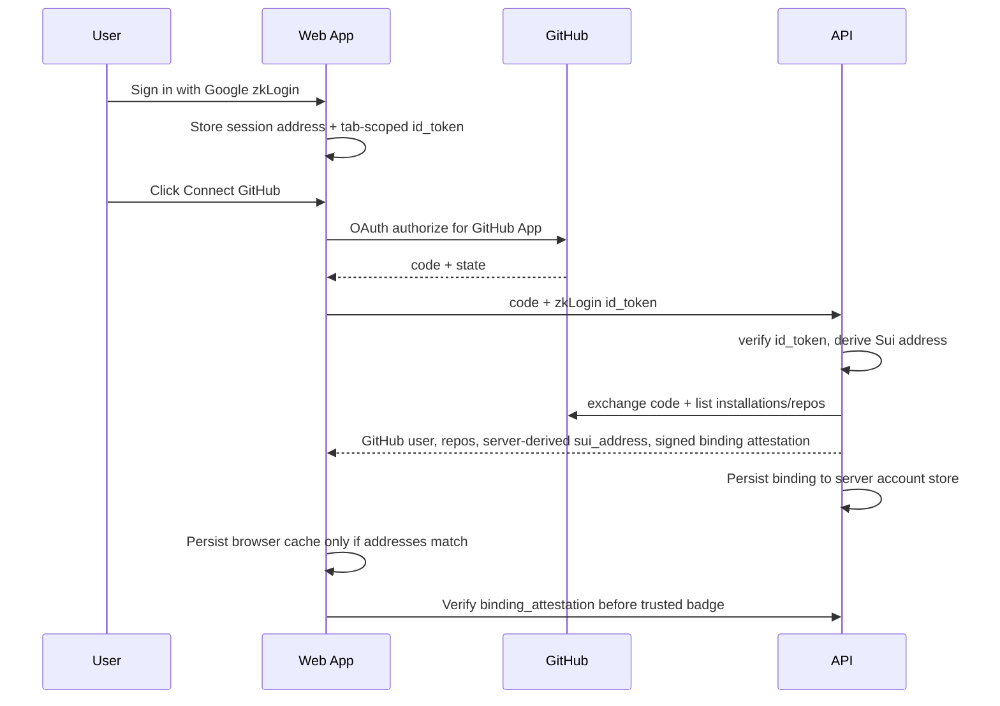
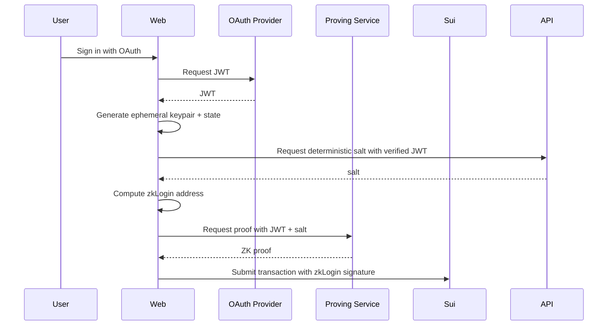

# 04. GitHub 接入、GitHub App 与 zkLogin

> **实现状态（2026-06-14）**：GitHub App 真实仓库流程已落地于 `src/core/github.ts`：App JWT(RS256) → installation access token → repo tree / commit / `asset.yaml` 读取 → fork repo，HTTP 依赖注入、vitest 覆盖；经 `/api/github/connect`、`/api/github/fork` 与 CLI `github:connect` 暴露。`/api/github/fork` 默认关闭，必须配置 `RN_GITHUB_FORK_API_TOKEN` 且请求带匹配 bearer token 才会执行。公网 GitHub 授权流已改为 Cursor 式 OAuth 回跳：`/auth/github-callback.html` 调 `api/github-oauth.ts` 交换 code、列出 installations/repos，并要求同时提交 zkLogin `id_token`，服务端验签后派生 `sui_address`；`api/github-oauth.ts` 同时返回 server-signed `binding_attestation`，通过 `upsertGithubRepositoryBinding` 写入服务端 `auth.json` 账户绑定（本地/API V1），登录页/账户页会通过 `api/github-binding.ts` 服务端验签后显示 `server-attested`。登录/账户页现在由 Vercel shell 静态输出（`research vercel:shell` / `.vercel-shell`），内容页、`/site-data.json` 与 PDF 继续走 Walrus Site 代理。zkLogin 真实地址派生已落地（`src/core/zklogin.ts` 用 `@mysten/sui` `jwtToAddress`）：salt service 先验 Google id_token，再用 `ZKLOGIN_SALT_SECRET` 确定性派生 salt；CLI login V1 已提供 `research login/whoami/logout`。Google Console redirect/origin 与 GitHub App client secret/callback/setup 已由用户补齐，生产环境已部署验证；生产级数据库/链上 attest 仍是下一阶段。

## 目标

平台需要同时支持：

- GitHub 作为工作区和代码权限来源。
- zkLogin 作为 Sui 低摩擦链上身份。
- 钱包连接作为高级用户和 Web3 用户入口。
- Agent 身份作为自动化发布主体。

## 账户模型

```text
PlatformAccount
├── user_id
├── github_user_id
├── github_username
├── sui_address
├── zklogin_subject_hash
├── evm_addresses[]
├── solana_addresses[]
├── agent_profiles[]
└── roles[]
```

## GitHub App vs OAuth App

采用 GitHub App 为主，因为：

- 细粒度仓库权限
- installation token 短期有效
- 可选择授权特定仓库
- 适合自动化读取和发布回写

OAuth App 只用于登录可以，但仓库接入建议用 GitHub App。

## 直接集成跨链登录平台

可以直接集成 Privy、Dynamic、Web3Auth、Particle、Lit 或自建 OIDC 这类跨链登录平台。推荐架构不是让它们替代 GitHub App，而是把它们作为统一身份入口：

```text
Cross-chain auth provider = social login + wallet linking + OIDC/JWT
GitHub/GitLab/Gitea App   = repository installation + code permissions
zkLogin                   = Sui transaction identity
```

原因是跨链登录平台能证明用户身份、聚合 EVM/Solana/Sui 钱包，部分平台还能给出 OIDC/JWT；但它们不会天然拥有用户 Git 仓库的 installation token。Research Asset 的源代码在 Git 平台上，读取仓库、创建 fork、回写 PR 仍然必须通过 GitHub App / GitLab App / Gitea OAuth 授权。

当前实现提供插件式 Auth 层：

- `POST /api/auth/login/start`：生成 Git 平台或跨链平台的授权 URL，并创建 zkLogin nonce。
- `POST /api/auth/login/complete`：绑定 Git identity、外部 provider subject、多链钱包和派生的 Sui zkLogin address。
- `ResearchClient.startLogin()` / `ResearchClient.completeLogin()`：SDK 入口。
- `research auth:start` / `research auth:complete`：CLI 调试入口。

生产环境接 Privy / Dynamic / Web3Auth 时，应由 Web App 使用对应 SDK 完成前端登录，再把已验证的 issuer、subject、wallets、GitHub installation id 传给 `completeLogin`。平台侧只保存账户绑定与 salt hash，不保存第三方长期 token；Git installation token 应短期缓存并加密存储。

## GitHub App 权限

建议权限：

```text
Repository permissions:
- Contents: Read & Write
- Metadata: Read-only
- Pull requests: Read & Write，可选
- Actions: Read-only，可选
- Issues: Read & Write，可选

Account permissions:
- Email: Read-only，可选
```

GitHub App 设置要求：

- App slug：`research-network-app`
- Install URL：`https://github.com/apps/research-network-app/installations/new`
- Callback URL（user authorization callback）：`https://research-network-web.vercel.app/auth/github-callback.html`
- Setup URL（安装/选择仓库后的回跳）：`https://research-network-web.vercel.app/auth/github-callback.html`
- 勾选 **Request user authorization during installation**，让安装/选择仓库后进入 OAuth code 回跳，而不是停在 GitHub settings/installations。
- 生成 client secret，只存入 Vercel env `GITHUB_APP_CLIENT_SECRET`；`GITHUB_APP_CLIENT_ID` / `GITHUB_APP_SLUG` 同样放平台环境变量或本地 secrets。
- 若 Setup URL 为空，用户选择仓库后会停留在 GitHub，站点无法收到 `installation_id`。

## GitHub 接入流程



## zkLogin 流程



## Salt 管理

Salt 不能随意丢失，否则地址不可恢复。可选策略：

1. 平台托管 salt：用户体验好，但平台责任更大。
2. 用户自持 salt：更去中心化，但体验差。
3. 派生 salt：从平台 secret + user stable id 通过 KDF 生成。
4. 多 Provider 绑定：GitHub、Google、钱包签名共同绑定一个 Profile。

建议：

```text
salt = HMAC(platform_salt_secret, issuer + subject + user_id)
```

并允许用户导出 recovery hint。

当前实现采用策略 3：`/api/zklogin-salt` 先验证 Google id_token，再按 `issuer + subject + audience` 派生确定性 salt；浏览器旧版 `rn_zk_salts` 随机 salt 会在新 callback 中清理，避免同一 Google 账号跨设备派生出不同地址。

## CLI 登录

CLI V1 面向本地 agent 使用：

```bash
research login [--port 8765] [--no-open]
research whoami
research logout
```

`research login` 起本地 loopback callback（默认 `http://localhost:8765/callback`），Google 返回 id_token 后由 CLI 校验 JWT/nonce，派生 zkLogin Sui 地址，并用本机 `.research-network/secrets/cli-session.key` 通过 AES-256-GCM 加密 token，session 写入 `.research-network/localnet/auth.json`。Google Console 必须注册 `http://localhost:8765/callback`，否则浏览器闭环会报 redirect mismatch。

## 身份绑定

用户需要将以下身份绑定到 PlatformAccount：

- GitHub username
- Sui zkLogin address
- 钱包地址
- EVM 地址
- Agent ID

绑定方式：

- GitHub：OAuth 回调证明。
- Sui：zkLogin transaction 或钱包签名。
- EVM：EIP-4361 Sign-In with Ethereum。
- Agent：owner 签名创建 Agent Passport。

## Agent 登录

Agent 不应该用人类 OAuth 自动冒充。推荐三种方式：

1. GitHub App installation token + 受限仓库权限。
2. Agent API key，与人类账户绑定。
3. Agent Passport NFT / SBT + 签名请求。

Agent API key 权限粒度：

```text
read:assets
write:assets
publish:assets
install:skills
access:intent
manage:repo
```

## 安全要求

- GitHub token 加密存储。
- installation token 短期缓存。
- OAuth state 必须防 CSRF。
- zkLogin ephemeral key 有过期时间。
- GitHub 绑定必须服务端校验 OAuth code 和当前 zkLogin id_token；OAuth 成功后写入服务端账户绑定（当前本地/API store V1，生产数据库/链上 attest 待接）；浏览器保存的绑定必须带 server-signed attestation，并经 `/api/github-binding` 验签后才能显示可信状态；仅浏览器 localStorage 绑定不得作为 CLI/agent 的长期可信来源。
- API key 支持撤销和范围限制。
- 所有发布操作必须有 nonce 和审计日志。
