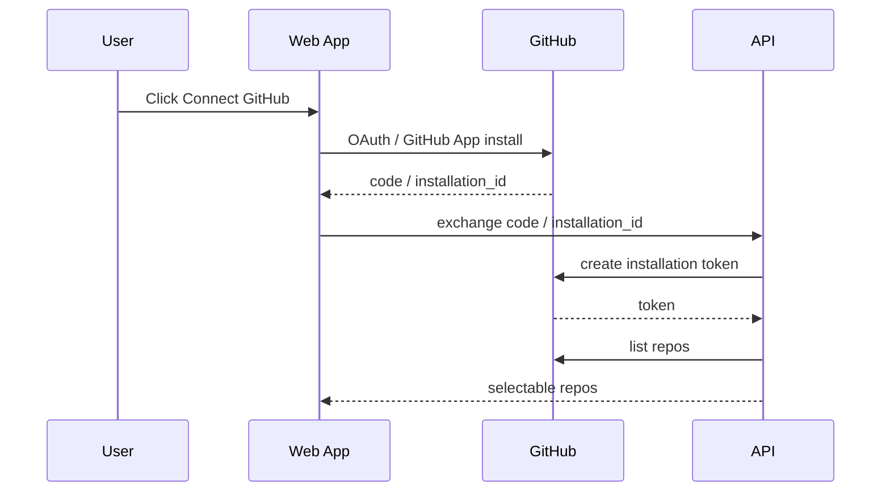
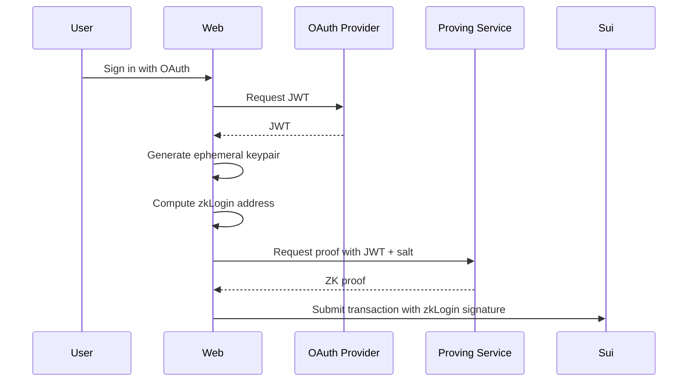

# 04. GitHub 接入、GitHub App 与 zkLogin

## 目标

平台需要同时支持：

- GitHub 作为工作区和代码权限来源。
- zkLogin 作为 Sui 低摩擦链上身份。
- 钱包连接作为高级用户和 Web3 用户入口。
- Agent 身份作为自动化发布主体。

## 账户模型

```text
PlatformAccount
├── user_id
├── github_user_id
├── github_username
├── sui_address
├── zklogin_subject_hash
├── evm_addresses[]
├── solana_addresses[]
├── agent_profiles[]
└── roles[]
```

## GitHub App vs OAuth App

采用 GitHub App 为主，因为：

- 细粒度仓库权限
- installation token 短期有效
- 可选择授权特定仓库
- 适合自动化读取和发布回写

OAuth App 只用于登录可以，但仓库接入建议用 GitHub App。

## 直接集成跨链登录平台

可以直接集成 Privy、Dynamic、Web3Auth、Particle、Lit 或自建 OIDC 这类跨链登录平台。推荐架构不是让它们替代 GitHub App，而是把它们作为统一身份入口：

```text
Cross-chain auth provider = social login + wallet linking + OIDC/JWT
GitHub/GitLab/Gitea App   = repository installation + code permissions
zkLogin                   = Sui transaction identity
```

原因是跨链登录平台能证明用户身份、聚合 EVM/Solana/Sui 钱包，部分平台还能给出 OIDC/JWT；但它们不会天然拥有用户 Git 仓库的 installation token。Research Asset 的源代码在 Git 平台上，读取仓库、创建 fork、回写 PR 仍然必须通过 GitHub App / GitLab App / Gitea OAuth 授权。

当前实现提供插件式 Auth 层：

- `POST /api/auth/login/start`：生成 Git 平台或跨链平台的授权 URL，并创建 zkLogin nonce。
- `POST /api/auth/login/complete`：绑定 Git identity、外部 provider subject、多链钱包和派生的 Sui zkLogin address。
- `ResearchClient.startLogin()` / `ResearchClient.completeLogin()`：SDK 入口。
- `research auth:start` / `research auth:complete`：CLI 调试入口。

生产环境接 Privy / Dynamic / Web3Auth 时，应由 Web App 使用对应 SDK 完成前端登录，再把已验证的 issuer、subject、wallets、GitHub installation id 传给 `completeLogin`。平台侧只保存账户绑定与 salt hash，不保存第三方长期 token；Git installation token 应短期缓存并加密存储。

## GitHub App 权限

建议权限：

```text
Repository permissions:
- Contents: Read & Write
- Metadata: Read-only
- Pull requests: Read & Write，可选
- Actions: Read-only，可选
- Issues: Read & Write，可选

Account permissions:
- Email: Read-only，可选
```

## GitHub 接入流程



## zkLogin 流程



## Salt 管理

Salt 不能随意丢失，否则地址不可恢复。可选策略：

1. 平台托管 salt：用户体验好，但平台责任更大。
2. 用户自持 salt：更去中心化，但体验差。
3. 派生 salt：从平台 secret + user stable id 通过 KDF 生成。
4. 多 Provider 绑定：GitHub、Google、钱包签名共同绑定一个 Profile。

建议：

```text
salt = HMAC(platform_salt_secret, issuer + subject + user_id)
```

并允许用户导出 recovery hint。

## 身份绑定

用户需要将以下身份绑定到 PlatformAccount：

- GitHub username
- Sui zkLogin address
- 钱包地址
- EVM 地址
- Agent ID

绑定方式：

- GitHub：OAuth 回调证明。
- Sui：zkLogin transaction 或钱包签名。
- EVM：EIP-4361 Sign-In with Ethereum。
- Agent：owner 签名创建 Agent Passport。

## Agent 登录

Agent 不应该用人类 OAuth 自动冒充。推荐三种方式：

1. GitHub App installation token + 受限仓库权限。
2. Agent API key，与人类账户绑定。
3. Agent Passport NFT / SBT + 签名请求。

Agent API key 权限粒度：

```text
read:assets
write:assets
publish:assets
install:skills
purchase:license
manage:repo
```

## 安全要求

- GitHub token 加密存储。
- installation token 短期缓存。
- OAuth state 必须防 CSRF。
- zkLogin ephemeral key 有过期时间。
- API key 支持撤销和范围限制。
- 所有发布操作必须有 nonce 和审计日志。
