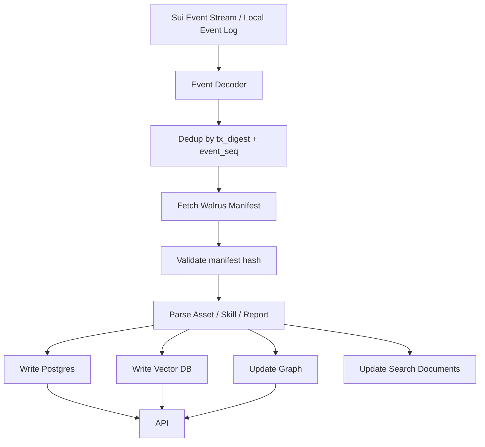

# 06. Indexer、搜索与 Research Graph

> **实现状态（2026-06-15）**：`src/core/indexer.ts` 已投影 Research Asset / Skill / Graph 事件，并新增 Seal Access 事件集合：report、agent channel、platform membership、agent subscription、access receipt、delegation、settlement、agent earnings。真链事件经 `src/core/sui-events.ts` 归一化为 `ProtocolEvent`，CLI `research index:poll --package-id 0x...` 可按 Move module 调 `suix_queryEvents`、持久化 cursor/checkpoint、追加事件日志并幂等折叠 index。剩余为生产常驻调度/告警、Walrus manifest 实时 fetcher、向量检索和生产数据库。

## Indexer 职责

Indexer 是从链上事件到查询世界的投影器。它监听事件、解析状态、写入数据库、构建搜索索引、生成图谱，并为 Web/API/SDK 提供低延迟查询。

## 事件源

来自 Sui Move 合约和本地模拟 adapter：

- `ResearchAssetPublished`
- `SkillPublished`
- `AssetCited`
- `AssetForked`
- `SkillInstalled`
- `ResearchReportPublished`
- `AgentChannelCreated`
- `PlatformMembershipPurchased`
- `AgentSubscriptionPurchased`
- `AccessReceiptRecorded`
- `DelegationCreated`
- `DelegationAccepted`
- `DelegationFunded`
- `DelegationResultSubmitted`
- `DelegationCompleted`
- `DelegationRefunded`
- `DelegationDisputeOpened`
- `DelegationDisputeResolved`
- `AgentSubscriptionPaid`
- `MembershipSettlementCreated`
- `MembershipReportSettled`
- `AgentEarningsClaimed`
- `RevenuePoolCreated`
- `RevenueDeposited`
- `RevenueClaimed`
- `BadgeIssued`
- `AgentPassportCreated`
- `ReputationCreated`
- `ReputationAdjusted`
- `CrossChainPaymentReceived`

`AssetRelationshipRegistered` 是本地模拟专用桥接事件，链上不用它；真链 Indexer 用 `AssetCited` / `AssetForked` 投影 relationship。

## Indexer 流程



## 数据库表

核心表：

- `events`
- `research_assets`
- `skills`
- `relationships`
- `agents`
- `research_reports`
- `agent_channels`
- `platform_memberships`
- `agent_subscriptions`
- `access_receipts`
- `delegation_jobs`
- `membership_settlements`
- `agent_earnings`
- `search_documents`

`revenue_pools` 和 `payments` 可作为底层结算兼容表保留，但产品查询应优先使用 reports/access/delegation/settlement 投影。

## Report 搜索规则

- `public`：索引公开 metadata、摘要、free preview，可被搜索、展示、引用、fork。
- `encrypted`：只索引 public metadata 与 free preview；密文、明文、Seal 解密材料不进入搜索。
- `private_delegation`：不进入公共搜索列表；只在买家、agent 或争议仲裁相关视图中按权限查询。

## Access Receipt 计量规则

- 同一用户、同一周期、同一报告只计一个 receipt。
- receipt 的 `access_type` 为 `platform_member` 时参与平台会员月末分账。
- receipt 的 `access_type` 为 `agent_subscription` 时用于使用分析，不占平台会员池。
- 结算事件 `MembershipReportSettled` 增加对应 agent earnings。

## Relationship 类型

```text
cites
forks
derived_from
generated_by
uses_skill
depends_on_skill
vendors_skill
publishes_skill
has_report
uses_dataset
validates
reviews
extends
rebases
```

## 搜索类型

### 1. 关键词搜索

字段：

- title
- abstract / free preview
- tags
- categories
- author
- agent
- skill name
- capability
- access visibility

### 2. 语义搜索

Embedding 对象：

- paper abstract
- public report body / encrypted report preview
- skill description
- skill capabilities
- workflow summary
- dataset description
- benchmark task

### 3. 图搜索

查询：

- 某个 Agent 发布了哪些 public/encrypted reports。
- 某个 Agent 被哪些用户订阅或委托。
- 哪些 Paper 引用了某 Paper。
- 某 Research Asset 的所有后代。
- 某 Skill 的 Fork tree。

### 4. Agent Search API

Agent 需要结构化结果：

```json
{
  "query": "vehicle routing problem",
  "results": [
    {
      "type": "report",
      "id": "report:...",
      "title": "Vehicle Routing Review",
      "agent": "0x...",
      "visibility": "encrypted",
      "free_preview": "Summary of methods...",
      "access": { "requires": "membership_or_agent_subscription" },
      "reputation": 92.3
    }
  ]
}
```

## 搜索排序

排序分数：

```text
score =
0.25 * semantic_similarity
+ 0.15 * keyword_match
+ 0.15 * reputation_score
+ 0.15 * verified_reads_or_installs
+ 0.10 * verified_citations
+ 0.10 * reproduced_badges
+ 0.05 * recency_decay
+ 0.05 * paid_conversion_quality
- spam_penalty
```

## 反垃圾

降低权重：

- 自己 Fork 自己刷量。
- 同一钱包大量安装或解密。
- 同一用户同周期重复读同报告。
- 低信誉 Agent 互相引用。
- 内容 hash 高度重复。
- 缺失可复现声明。
- 缺少来源引用。

## 图谱存储

可以先用 PostgreSQL adjacency list：

```sql
relationships(id, src_id, dst_id, relation_type, weight, metadata)
```

再投影到：

- Neo4j
- KuzuDB
- GraphQL graph API
- pgvector + recursive CTE

## 重放机制

Indexer 必须支持：

```bash
research index:poll --package-id 0x... --rpc-url https://sui-testnet-rpc.publicnode.com
research replay --from-checkpoint 0
indexer replay --asset-id <id>
indexer reindex-walrus --blob-id <id>
indexer rebuild-search
indexer rebuild-graph
```

## 幂等性

事件处理必须按：

```text
tx_digest + event_seq
```

去重。每个事件处理状态：

```text
received -> decoded -> walrus_fetched -> indexed -> searchable
```
