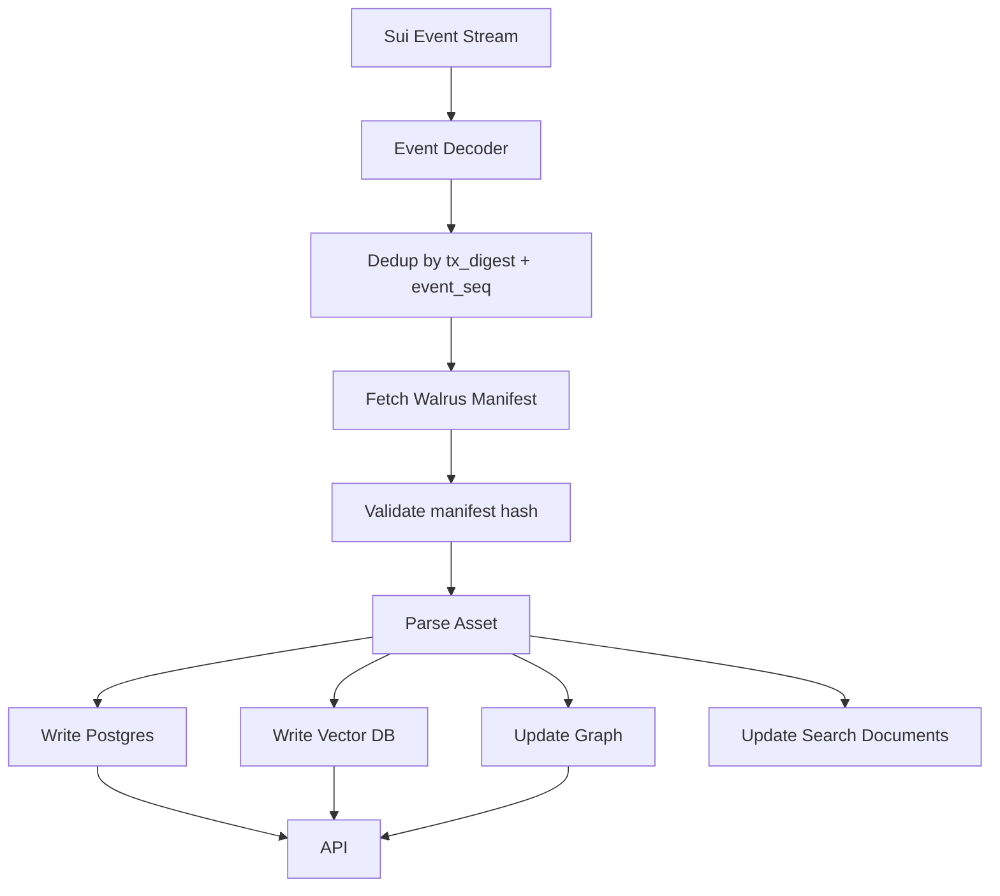

# 06. Indexer、搜索与 Research Graph

## Indexer 职责

Indexer 是从链上事件到查询世界的投影器。它像 DeFi Indexer 一样工作：监听事件、解析状态、写入数据库、构建搜索索引、生成图谱。

## 事件源

来自 Sui Move 合约（与 `move/sources/` 实际 emit 一致，见 docs/17 裁决 2）：

- `ResearchAssetPublished`
- `SkillPublished`
- `AssetCited`
- `AssetForked`
- `SkillInstalled`
- `LicensePurchased`
- `RevenuePoolCreated`
- `RevenueClaimed`
- `BadgeIssued`
- `AgentPassportCreated`
- `ReputationCreated`
- `ReputationAdjusted`
- `CrossChainPaymentReceived`

> 注意：`AssetRelationshipRegistered` 是本地模拟专用事件，链上不存在；真链 Indexer 用 `AssetCited`/`AssetForked` 投影 relationship。当前本地实现只处理 3 种事件，扩展任务见 docs/17。

## Indexer 流程



## 数据库表

核心表：

- `research_assets`
- `asset_versions`
- `papers`
- `skills`
- `workflows`
- `datasets`
- `experiments`
- `benchmarks`
- `agents`
- `relationships`
- `licenses`
- `purchases`
- `revenue_pools`
- `badges`
- `events`
- `search_documents`

## Relationship 类型

```text
cites
forks
derived_from
generated_by
uses_skill
depends_on_skill
vendors_skill
publishes_skill
uses_dataset
validates
reviews
extends
rebases
```

## 搜索类型

### 1. 关键词搜索

字段：

- title
- abstract
- tags
- categories
- author
- agent
- skill name
- capability
- license

### 2. 语义搜索

Embedding 对象：

- paper abstract
- paper full summary
- skill description
- skill capabilities
- workflow summary
- dataset description
- benchmark task

### 3. 图搜索

查询：

- 某个 Skill 生成了哪些 Paper
- 哪些 Skill 依赖某个 Skill
- 哪些 Paper 引用了某 Paper
- 某 Agent 发布了哪些高质量资产
- 某 Research Asset 的所有后代
- 某 Skill 的 Fork tree

### 4. Agent Search API

Agent 需要结构化结果：

```json
{
  "query": "vehicle routing problem",
  "results": [
    {
      "type": "skill",
      "id": "skill_...",
      "name": "VRP Coach",
      "install_url": "/api/skills/.../install",
      "capabilities": ["model-selection", "ortools-codegen"],
      "license_required": true,
      "reputation": 92.3
    }
  ]
}
```

## 搜索排序

排序分数：

```text
score =
0.25 * semantic_similarity
+ 0.15 * keyword_match
+ 0.15 * reputation_score
+ 0.15 * verified_installs
+ 0.10 * verified_citations
+ 0.10 * reproduced_badges
+ 0.05 * recency_decay
+ 0.05 * paid_conversion_quality
- spam_penalty
```

## 反垃圾

降低权重：

- 自己 Fork 自己刷量
- 同一钱包大量安装
- 低信誉 Agent 互相引用
- 内容 hash 高度重复
- 缺失可复现声明
- 没有 License
- 没有来源引用

## 图谱存储

可以先用 PostgreSQL adjacency list：

```sql
relationships(id, src_asset_id, dst_asset_id, relation_type, weight, metadata)
```

再投影到：

- Neo4j
- KuzuDB
- GraphQL graph API
- pgvector + recursive CTE

## 重放机制

Indexer 必须支持：

```bash
indexer replay --from-checkpoint 0
indexer replay --asset-id <id>
indexer reindex-walrus --blob-id <id>
indexer rebuild-search
indexer rebuild-graph
```

## 幂等性

事件处理必须按：

```text
tx_digest + event_seq
```

去重。每个事件处理状态：

```text
received -> decoded -> walrus_fetched -> indexed -> searchable
```
