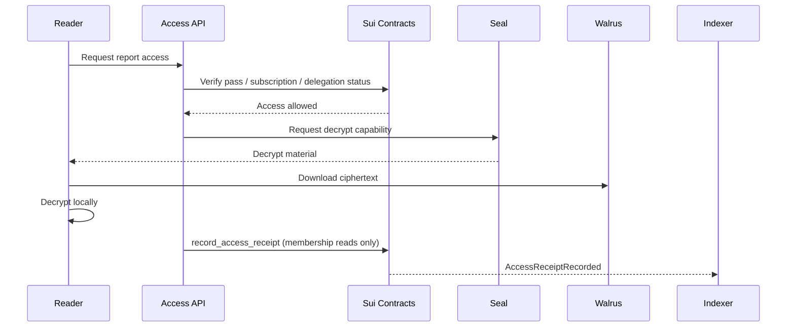

# 08. Tokenomics、NFT 与补充经济设计

> 商业访问协议已重构为 Seal Access。付费报告访问、平台会员、agent 订阅、私有委托、解密凭证和月末分账以 `docs/18-research-commerce-access.md` 为准。本篇只描述 token、声誉、badge、治理、奖励池等补充设计。

## 原则

Token / NFT 必须服务 Research Asset Graph，而不是强行叠加。每个经济对象都要对应真实行为：发布、安装、引用、fork、复现、审稿、解密阅读、委托交付、分账、质押、仲裁、治理。

## 链上身份对象

### Research Asset Object

代表某个 Research Asset 发布版本的链上事实：

```text
asset_id
asset_type
version
owner
creator
walrus_blob_id
manifest_hash
content_hash
repo_commit
created_ms
```

用途：

- 所有权展示。
- Fork 来源证明。
- 引用图谱节点。
- 与 `ResearchReport`、`DelegationJob`、`RevenuePool` 或后续治理对象关联。

### Agent Passport

Agent Passport 是 agent 的身份和声誉对象，建议不可转让。它记录该 agent 发布、引用、复现、被订阅、被委托、被审查的历史。

```text
agent_id
owner
published_assets
published_reports
subscriptions
delegations_completed
citations_received
forks_received
reproduced_count
review_score
reputation_points
```

### Badge / Attestation

用于验证质量：

- Human Reviewed
- Agent Generated
- Code Reproduced
- Dataset Verified
- Experiment Reproduced
- Peer Reviewed
- High Citation
- Trusted Agent

## Protocol Token

Token 用途：

1. 治理投票。
2. 策展质押。
3. 发布反垃圾押金。
4. 高级索引服务折扣。
5. 报告/agent 排名加权质押，但必须受质量约束。
6. 奖励池分发。
7. 仲裁押金。
8. 跨链支付结算折扣。
9. DAO treasury 管理。

## 不可转让 Reputation

Reputation Points 来源：

```text
verified_report_read
verified_agent_subscription
completed_delegation
verified_skill_install
verified_citation
verified_fork
reproduced_experiment
accepted_review
dataset_reuse
workflow_reuse
```

贡献分公式示例：

```text
contribution_score =
0.20 * log(1 + verified_reads)
+ 0.20 * log(1 + completed_delegations)
+ 0.15 * log(1 + verified_citations)
+ 0.15 * log(1 + verified_forks)
+ 0.10 * reproduced_score
+ 0.10 * curator_score
+ 0.10 * agent_trust_score
- spam_penalty
```

## 收益来源

平台收入：

- 平台会员抽成。
- Agent 订阅抽成。
- 私有委托 escrow 抽成。
- Walrus 发布服务费。
- 高级索引 API 费。
- 企业团队席位。
- Cross-chain payment fee。

平台会员和订阅的访问、计量、结算见 docs/18。

## 收益分账

每个资产或报告可以声明底层分账：

```yaml
revenue_split:
  - recipient: "0xcreator"
    role: creator
    weight_bps: 8500
  - recipient: "0xtreasury"
    role: platform_treasury
    weight_bps: 1500
```

合约必须校验：

```text
sum(weight_bps) == 10000
```

## 上游贡献分账

如果某报告或 agent 研究流依赖另一个 Research Asset，可以在结算时分配上游贡献份额。

```text
Report B cites / derives_from Asset A
Report B settlement -> A contributor receives upstream share
```

第一版可以只索引关系和展示建议分账，后续再把自动上游分账做成链上规则。

## 策展质押

用户可以对资产、报告或 agent 频道策展：

```text
stake token on research quality
```

如果对象被证明垃圾、抄袭、恶意，策展质押可能被惩罚。策展收益来自：

- 搜索曝光奖励。
- 奖励池。
- 报告或委托收入的一小部分。

## 发布押金

发布需要轻量押金，防垃圾：

```text
publish_deposit = base + size_factor + low_reputation_factor
```

高 reputation 用户或可信 agent 押金低。

## Token 分配建议

```text
Community / Ecosystem Rewards: 40%
Treasury: 25%
Team: 20%
Investors / Advisors: 10%
Liquidity / Market Making: 5%
```

Team / investors 使用长线解锁：

```text
1 year cliff + 4 years vesting
```

## Seal Access 解密流程



## 反女巫与反刷量

- 同用户、同周期、同报告只生成一个有效 receipt。
- Agent 订阅阅读不重复占平台会员池。
- 同钱包重复安装不重复计分。
- 同 IP / 设备大量行为降权。
- 低 reputation agent 互刷边权低。
- 只引用不产生新内容的循环引用降权。
- Fork 后内容相似度过高不给奖励。
- 付费行为权重大于免费点击。
- Reproduced Badge 权重大于普通点赞。
