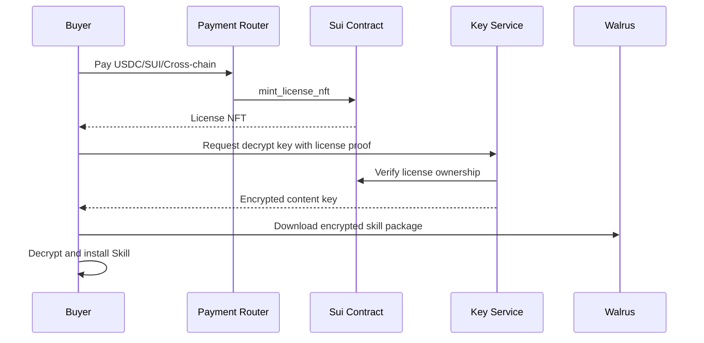

# 08. Tokenomics、NFT、License 与收益设计

## 原则

Token / NFT 必须服务 Research Asset Graph，而不是强行叠加。系统中每个经济对象都要对应真实行为：发布、安装、引用、Fork、复现、审稿、购买、分账、质押、仲裁、治理。

## 资产 NFT 类型

### 1. Research Asset NFT

代表某个 Research Asset 发布版本的链上身份。

字段：

```text
asset_id
asset_type
version
owner
creator
walrus_blob_id
manifest_hash
license_id
revenue_pool_id
```

用途：

- 所有权展示
- 转让
- 收益领取权
- Fork 来源证明
- 引用图谱节点

### 2. Skill License NFT

代表 Skill 使用权，而不是版权。

类型：

```text
Personal License
Agent License
Team License
Commercial License
Subscription License
Lifetime License
```

权限：

- 安装 Skill
- 下载加密包
- 接收更新
- 使用私有模板
- 商业使用
- Agent 自动调用

### 3. Founder Pass NFT

早期社区权益：

- 平台手续费折扣
- Premium Skill 访问
- Alpha API 配额
- 社区身份
- 治理资格
- 早期空投资格记录

### 4. Agent Passport SBT

不可转让。记录 Agent 的研究声誉。

字段：

```text
agent_id
owner
published_assets
installed_skills
citations_received
forks_received
reproduced_count
review_score
reputation_points
```

### 5. Badge / Attestation NFT

用于验证质量：

- Human Reviewed
- Agent Generated
- Code Reproduced
- Dataset Verified
- Experiment Reproduced
- Peer Reviewed
- High Citation
- Trusted Skill

## Protocol Token

Token 用途：

1. 治理投票。
2. 策展质押。
3. 发布反垃圾押金。
4. 高级索引服务折扣。
5. Skill 排名加权质押，但必须受质量约束。
6. 奖励池分发。
7. 仲裁押金。
8. 跨链支付结算折扣。
9. DAO treasury 管理。

## 不可转让 Reputation

Reputation Points 来源：

```text
verified_skill_install
verified_citation
verified_fork
reproduced_experiment
paid_purchase
accepted_review
dataset_reuse
workflow_reuse
```

贡献分公式：

```text
contribution_score =
0.25 * log(1 + verified_installs)
+ 0.20 * log(1 + verified_citations)
+ 0.15 * log(1 + verified_forks)
+ 0.15 * reproduced_score
+ 0.10 * paid_revenue_score
+ 0.10 * curator_score
+ 0.05 * agent_trust_score
- spam_penalty
```

## 收益来源

平台收入：

- Skill 销售抽成
- License NFT 销售抽成
- Workflow 销售抽成
- Dataset 付费访问抽成
- Agent compute job 抽成
- Walrus 发布服务费
- 高级索引 API 费
- 企业 License
- Cross-chain payment fee

## 收益分账

每个资产可以声明：

```yaml
revenue_split:
  - recipient: "0xcreator"
    role: creator
    weight_bps: 7000
  - recipient: "0xupstream_skill"
    role: upstream_skill
    weight_bps: 1000
  - recipient: "0xtreasury"
    role: protocol_treasury
    weight_bps: 1500
  - recipient: "0xrewards"
    role: ecosystem_rewards
    weight_bps: 500
```

合约必须校验：

```text
sum(weight_bps) == 10000
```

## 上游贡献分账

如果某 Skill 依赖另一个 Skill，销售时可以自动分账给上游。

关系：

```text
Skill B depends_on Skill A
Skill B sale -> A receives upstream share
```

## 策展质押

用户可以对资产策展：

```text
stake token on asset quality
```

如果资产被证明垃圾、抄袭、恶意，策展质押可能被惩罚。策展收益来自：

- 搜索曝光奖励
- 奖励池
- 资产收入的一小部分

## 发布押金

发布需要轻量押金，防垃圾：

```text
publish_deposit = base + size_factor + low_reputation_factor
```

高 Reputation 用户押金低。

## Token 分配建议

```text
Community / Ecosystem Rewards: 40%
Treasury: 25%
Team: 20%
Investors / Advisors: 10%
Liquidity / Market Making: 5%
```

Team / investors 使用长线解锁：

```text
1 year cliff + 4 years vesting
```

## License 购买流程



## 反女巫与反刷量

- 同钱包重复安装不重复计分。
- 同 IP / 设备大量行为降权。
- 低 Reputation 互刷边权低。
- 只引用不产生新内容的循环引用降权。
- Fork 后内容相似度过高不给奖励。
- 付费行为权重大于免费点击。
- Reproduced Badge 权重大于普通点赞。
