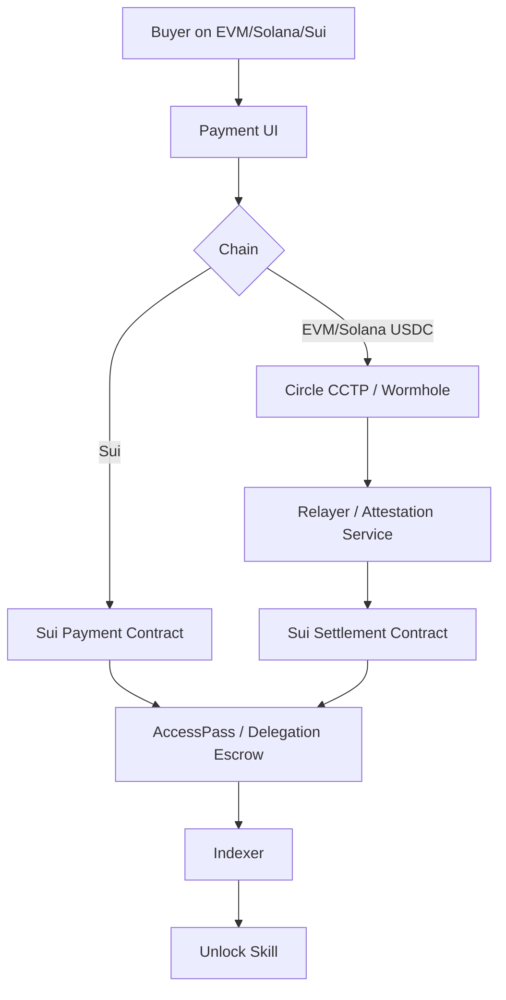

# 09. 跨链支付与结算设计

## 目标

用户可以在不同链上支付，但 Research Asset 的 canonical registry 在 Sui 上。支付体验支持：

- Sui / USDC on Sui
- EVM USDC on Base / Ethereum / Arbitrum / Optimism
- Solana USDC
- 跨链 USDC 转账
- 法币入口转换为 USDC / SUI

## 原则

- Sui 是 canonical registry。
- 其他链是支付入口。
- 支付完成后必须在 Sui 上记录 access intent 结算：平台会员、agent 订阅或私有委托 escrow。
- 不要把每条链都变成资产主注册地，避免状态分裂。

## 支付架构



## Sui 本地支付

支持：

- SUI
- USDC on Sui
- Protocol Token

合约入口（Seal Access 目标态，见 docs/17 与 docs/18）：

```move
entry fun buy_platform_membership(
    tier: u64,
    payment: Coin<USDC>,
    clock: &Clock,
    ctx: &mut TxContext
)
```

买家身份取 `tx_context::sender(ctx)`，时间取链上 `Clock`，不由调用者传入。

## EVM / Solana 跨链支付

设计：

1. 用户在源链支付 USDC。
2. 通过 CCTP burn / mint 或 Wormhole CCTP Bridge 把 USDC 到目标链。
3. 携带 payload：`buyer_sui_address, access_kind, target_id, order_id`。
4. Relayer / Executor 在 Sui 上调用结算合约。
5. Sui 合约记录 PlatformMembershipPass、AgentSubscriptionPass 或 DelegationJob escrow。
6. Indexer 记录 `CrossChainPaymentReceived`。

## Order ID

所有跨链订单必须有唯一 ID：

```text
order_id = hash(buyer + source_chain + source_tx + skill_id + nonce)
```

防止重复执行。

## Payment Intent

API 创建支付意图：

```json
{
  "order_id": "ord_...",
  "kind": "agent_subscription",
  "target": "agent:...",
  "amount": "49.00",
  "currency": "USDC",
  "accepted_chains": ["sui", "base", "ethereum", "solana"],
  "recipient_sui_address": "0x...",
  "expires_at": "..."
}
```

## Relayer

Relayer 负责：

- 监听源链支付事件
- 验证 CCTP attestation
- 调用 Sui settlement
- 处理失败重试
- 提供 proof 给前端

Relayer 必须幂等：

```text
order_id 已结算 -> 拒绝重复 mint
```

## 收益分账

跨链支付最后归集到 Sui RevenuePool，再按 bps 分账。避免多链多套分账逻辑。

## 风险

- 跨链桥风险
- Attestation 延迟
- 价格波动
- 重放攻击
- Payload 篡改
- Relayer 故障

## 对策

- 所有订单有 expiration。
- order_id + source_tx 唯一。
- Sui 合约验证已处理订单。
- Relayer 多实例。
- 前端显示支付状态：pending / bridged / settled / access active。
