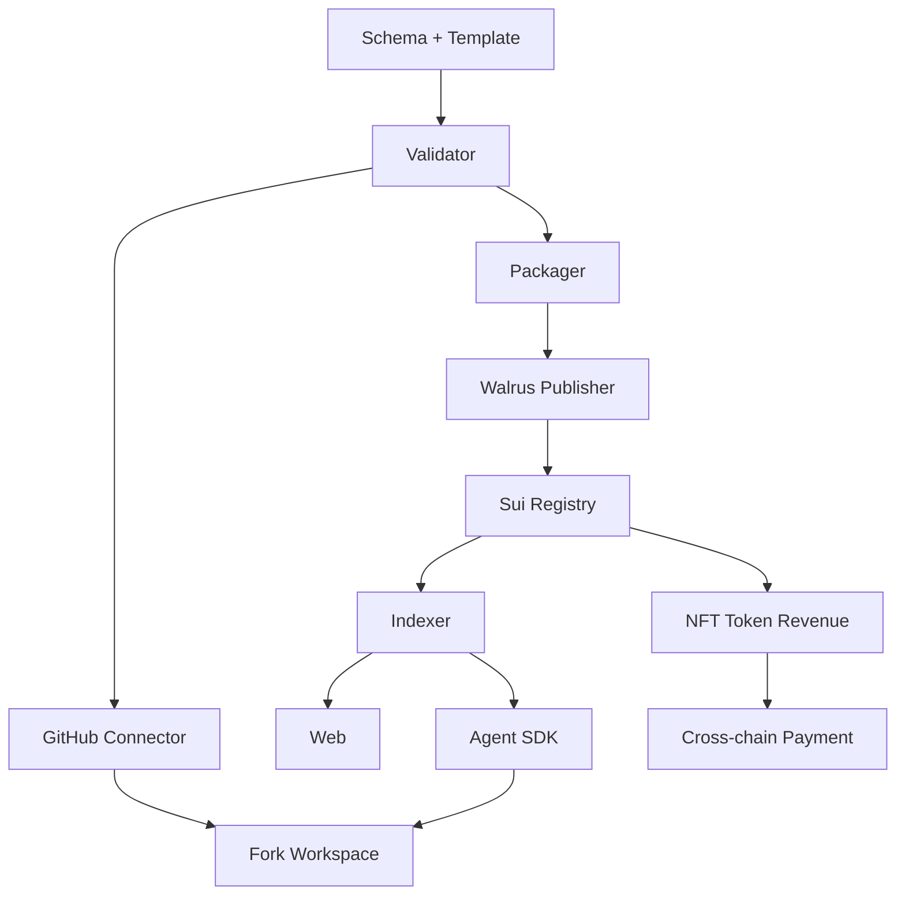

# 15. 开发工作流与任务图

本文件不按产品版本划分，而按依赖关系和工作流划分。所有模块都属于完整系统设计的一部分。

> 各工作流的"状态"标注与实施次序建议见 docs/17（实施 Agent 先读那一篇）。状态含义：✅ 已实现 / 🔶 本地模拟或部分实现 / ❌ 仅设计。

## 工作流 A：标准与模板

状态：✅ 已实现（vitest 覆盖）。

产物：

- `schemas/asset.schema.json`
- `schemas/skill.schema.json`
- `schemas/workflow.schema.json`
- `templates/research-asset-template/`
- `skills/research-workspace-init/SKILL.md`
- `research-cli init/validate`

完成标准：

- Agent 可以根据模板创建仓库。
- Validator 可以识别 Paper / Skill / Workflow。
- 所有样例仓库可通过 schema 校验。

## 工作流 B：GitHub 接入

状态：❌ 仅设计（当前只有 `auth:start` 生成授权 URL，无 installation token / repo 读取）。

产物：

- GitHub App
- OAuth 登录
- installation token 管理
- repo selector
- repo tree fetcher
- commit resolver
- fork workspace creator

完成标准：

- 用户可连接指定仓库。
- API 可读取 `asset.yaml`。
- API 可基于资产创建 fork 仓库。

## 工作流 C：zkLogin 与账户系统

状态：🔶 本地模拟（账户绑定流程已实现，zkLogin 地址为本地派生，无真实 prover / 签名上链）。

产物：

- GitHub account 绑定
- zkLogin address 生成
- salt 管理
- wallet 绑定
- Agent Passport 创建
- API key 管理

完成标准：

- 用户可用 OAuth 生成 Sui 地址。
- 用户可签名发布交易。
- Agent 可用受限 key 发布。

## 工作流 D：Walrus Publisher

状态：🔶 部分实现（打包/manifest/checksum 已实现；testnet 上传与 Walrus Sites 部署走 CLI，已验证；加密 Skill 包未实现）。

产物：

- release packager
- manifest generator
- checksum generator
- Walrus upload service
- encrypted skill package
- Walrus Sites deployer

完成标准：

- 仓库可打包上传 Walrus。
- blob id 可写入 Sui。
- 网站可发布到 Walrus Sites。

## 工作流 E：Sui Move Protocol

状态：🔶 骨架已部署 testnet（事件公证层；无 Coin 托管、无权限校验、无 Move 测试 —— 信任边界见 docs/17）。

产物：

- ResearchAsset
- SkillAsset
- License NFT
- RevenuePool
- AgentPassport
- Reputation
- Badge
- CrossChainSettlement
- Events

完成标准：

- 所有核心行为都有 entry fun。
- 所有核心行为都 emit event。
- Move tests 覆盖发布、购买、分账、跨链结算。

## 工作流 F：Indexer

状态：🔶 本地模拟（事件重放/搜索/图谱已实现，仅消费本地事件日志；不消费链上事件，事件覆盖仅 3 种）。

产物：

- event listener
- checkpoint tracker
- Walrus manifest fetcher
- DB writer
- vector indexer
- graph projector
- replay CLI

完成标准：

- 从链上事件重建 asset / skill / graph。
- 任意事件可幂等重放。
- 搜索接口可查询新发布资产。

## 工作流 G：Web App

状态：🔶 静态站点生成已实现并发布 Walrus Sites testnet；交互式 Publish/Payment/Dashboard 流程仅设计。

产物：

- 首页
- Search
- Asset page
- Skill page
- Publish flow
- Fork flow
- Dashboard
- Payment flow
- Graph viewer
- Walrus Sites build

完成标准：

- 页面展示链上和 Walrus 可验证信息。
- 用户可完成发布、安装、购买、Fork。
- 静态站点可发布到 Walrus Sites。

## 工作流 H：跨链支付

状态：❌ 仅设计（本地 payment intent 桩已有；无 CCTP/Wormhole 集成，链上结算入口无 attestation 验证）。

产物：

- payment intent
- Sui payment
- EVM / Solana USDC intent
- CCTP / Wormhole relayer
- Sui settlement
- License mint
- order id 防重放

完成标准：

- 源链支付可结算到 Sui License。
- 重复订单不能重复 mint。
- Indexer 可显示支付状态。

## 工作流 I：Token / NFT / 治理

状态：❌ 仅设计（badge/reputation 合约为事件骨架；Token、质押、策展、治理、仲裁均未实现）。

产物：

- Research Asset NFT
- Skill License NFT
- Founder Pass
- Agent Passport
- Badge
- Protocol Token
- Reputation
- Staking
- Curation
- Rewards
- Governance
- Dispute

完成标准：

- NFT 权限和收益绑定资产。
- Reputation 可由事件计算。
- Token 可用于治理、质押、奖励和折扣。
- 争议流程可被事件索引。

## 工作流 J：Agent SDK

状态：🔶 本地实现（REST API / SDK / CLI 可用，对接本地模拟网络；无鉴权、无 API key 体系）。

产物：

- REST API
- TypeScript SDK
- CLI
- Agent install protocol
- Agent publish protocol
- Agent search protocol

完成标准：

- Agent 可不打开网页完成核心流程。
- SDK 能在 Claude/Codex/Cursor/OpenHands 工作区使用。

## 依赖图

