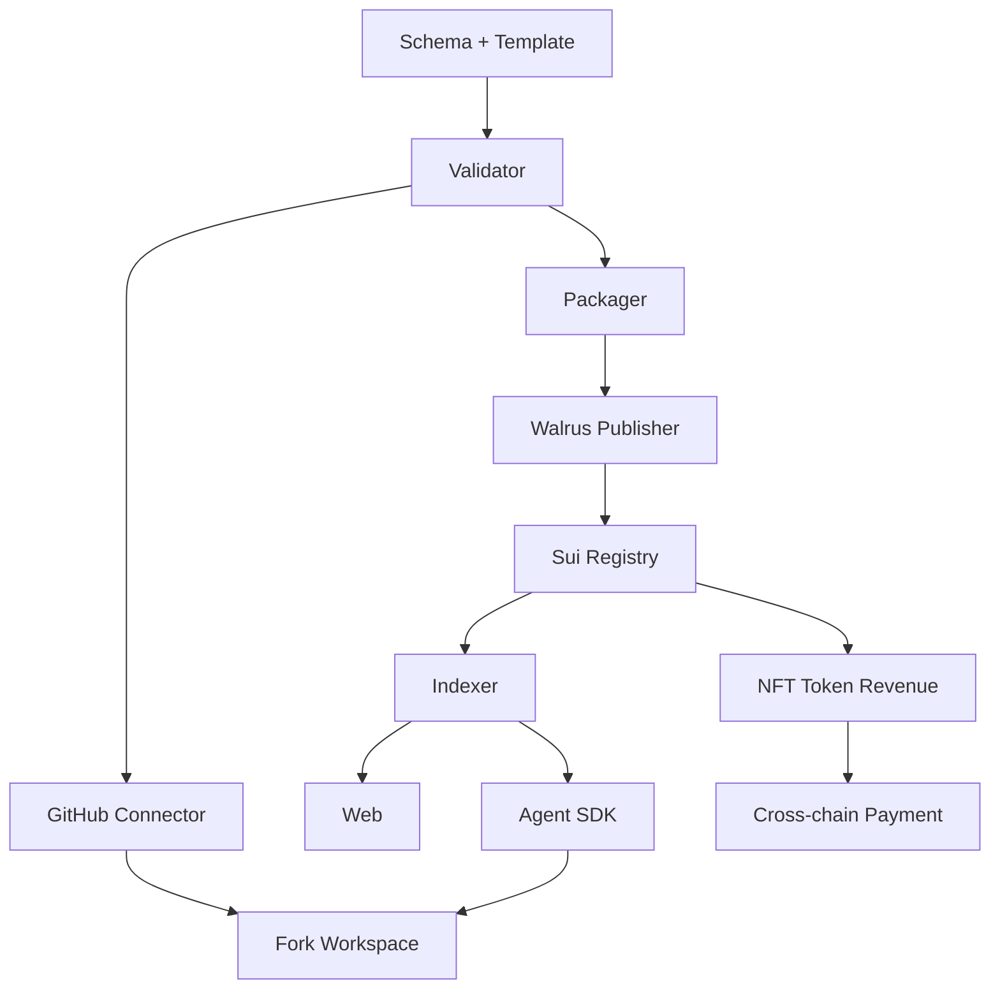

# 15. 开发工作流与任务图

本文件不按产品版本划分，而按依赖关系和工作流划分。所有模块都属于完整系统设计的一部分。

> 各工作流的"状态"标注与实施次序建议见 docs/17（实施 Agent 先读那一篇）。状态含义：✅ 已实现 / 🔶 本地模拟或部分实现 / ❌ 仅设计。

## 工作流 A：标准与模板

状态：✅ 已实现（vitest 覆盖）。

产物：

- `schemas/asset.schema.json`
- `schemas/skill.schema.json`
- `schemas/workflow.schema.json`
- `templates/research-asset-template/`
- `skills/research-workspace-init/SKILL.md`
- `research-cli init/validate`

完成标准：

- Agent 可以根据模板创建仓库。
- Validator 可以识别 Paper / Skill / Workflow。
- 所有样例仓库可通过 schema 校验。

## 工作流 B：GitHub 接入

状态：🔶 真实流程已实现 + 测试 + 生产配置已补齐（`src/core/github.ts`：App JWT(RS256)→installation token→repo tree/commit/`asset.yaml`→fork repo；HTTP 依赖注入、vitest 覆盖）。本地 API `/api/github/connect`、`/api/github/fork` 与 CLI `github:connect` 已接；`/api/github/fork` 默认禁用，必须配置 `RN_GITHUB_FORK_API_TOKEN` 且 bearer token 匹配才会执行。公网 GitHub OAuth 回跳由 Vercel function `api/github-oauth.ts` 处理：交换 code、列 installations/repos，要求 zkLogin `id_token` 服务端验签后返回 `sui_address`，签发 server-signed binding attestation，并通过 `upsertGithubRepositoryBinding` 写入服务端 `auth.json` 账户绑定（本地/API V1；生产数据库/链上 attest 仍待接）。Vercel shell 已生成 GitHub authorize 入口与 `/auth/github-callback.html`；GitHub App client secret、Callback URL、Request user authorization、Setup URL 已由用户配置完成。

产物：

- GitHub App
- OAuth 登录
- installation token 管理
- repo selector
- repo tree fetcher
- commit resolver
- fork workspace creator

完成标准：

- 用户可连接指定仓库。
- API 可读取 `asset.yaml`。
- API 可基于资产创建 fork 仓库。

## 工作流 C：zkLogin 与账户系统

状态：🔶 真实地址派生已落地（`src/core/zklogin.ts` 用 `@mysten/sui` `jwtToAddress`：提供 OIDC id_token 时派生**真实 Sui zkLogin 地址**；JWT/JWKS 验签、nonce、确定性 salt、prover 调用已实现，HTTP 注入可测，vitest 覆盖；API auth 层仍保留无 jwt 的本地 deterministic 派生用于 dev/test）。Vercel shell 登录页调用 `/api/zklogin-salt`，salt service 验 id_token 后用 `ZKLOGIN_SALT_SECRET` 派生稳定 salt；CLI login V1 已接 `research login/whoami/logout`（loopback + 加密 token 存储）。API `/api/zklogin/address`、`/api/zklogin/prove` 与 CLI `zklogin:address` 仍可调试使用。**上线需** Google Console 注册 Vercel origin/redirect 与 CLI redirect；真实交易签名还需 prover URL（`ZKLOGIN_PROVER_URL`）+ 钱包/zkLogin proof 对接。

产物：

- GitHub account 绑定
- zkLogin address 生成
- salt 管理
- wallet 绑定
- Agent Passport 创建
- API key 管理

完成标准：

- 用户可用 OAuth 生成 Sui 地址。
- 用户可签名发布交易。
- Agent 可用受限 key 发布。

## 工作流 D：Walrus Publisher

状态：🔶 部分实现（打包/manifest/checksum 已实现；testnet 上传与 Walrus Sites 部署走 CLI，已验证；加密 Skill 包未实现）。

产物：

- release packager
- manifest generator
- checksum generator
- Walrus upload service
- encrypted skill package
- Walrus Sites deployer

完成标准：

- 仓库可打包上传 Walrus。
- blob id 可写入 Sui。
- 网站可发布到 Walrus Sites。

## 工作流 E：Sui Move Protocol

状态：✅ Seal Access 本地源码已实现 + Move 测试。新增 `report.move`、`access.move`、`delegation.move`、`settlement.move`，删除旧 `license.move`；本轮不默认重新部署 Sui testnet package。历史 v2 revenue/payment 包已部署并完成 revenue 链上冒烟，见 docs/16。

产物：

- ResearchAsset
- SkillAsset
- ResearchReport
- AccessPass
- DelegationJob
- Settlement
- RevenuePool
- AgentPassport
- Reputation
- Badge
- CrossChainSettlement
- Events

完成标准：

- ✅ 所有核心行为都有入口函数（v2 用 `public fun`）。
- ✅ 所有核心行为都 emit event。
- ✅ Move tests 覆盖 public/encrypted/private report、membership/subscription access、private delegation escrow、争议授权、会员结算、重复结算拒绝。
- 剩余：Seal Access testnet 发布、真实 CCTP/Wormhole VAA 验签、浏览器交易闭环。

## 工作流 F：Indexer

状态：🔶 全量事件目录 + 幂等重放 + Sui RPC poller V1 已实现（`applyEvent` 纯函数 + 可插拔 `manifestLoader`；AssetCited/AssetForked→图谱，report/membership/subscription/receipt/delegation/settlement→Seal Access 状态；vitest 覆盖）。`sui-events.ts` 提供 `normalizeSuiEvent`/`ingestSuiEvents` 与 `pollSuiEvents`，CLI `research index:poll --package-id 0x...` 会按 Move module 调 `suix_queryEvents`、持久化 cursor/checkpoint、追加事件日志并折叠 index；剩生产常驻调度/监控、Walrus manifest 实时 fetcher、向量检索。

产物：

- event listener
- checkpoint tracker（V1 cursor/checkpoint 已落盘，生产调度待接）
- Walrus manifest fetcher
- DB writer
- vector indexer
- graph projector
- replay CLI

完成标准：

- 🔶 从事件重建 asset / skill / graph（本地事件已支持全量目录；真链 Sui RPC poller V1 已接）。
- ✅ 任意事件可幂等重放（`applyEvent` 按 `tx_digest:event_seq` 去重，累计状态不重复计）。
- ✅ 搜索接口可查询新发布资产、public report、encrypted report preview；private delegation 不进入公共搜索。
- 剩余：生产常驻调度/监控、Walrus manifest 实时 fetcher、向量检索、更多 replay/reindex 子命令。

## 工作流 G：Web App

状态：🔶 静态站点生成已实现并发布 Walrus Sites testnet；Vercel 生产入口采用 shell 模式：`/login.html`、`/account.html`、`/auth/*`、`/zklogin-browser.js` 由 `.vercel-shell` 静态服务，内容页、`/site-data.json` 与 PDF 通过 `api/walrus.ts` 代理 Walrus Site。代理已支持资源映射缓存，`rn_verify` / `refresh` / `cache_bust` 绕过缓存，Range/超过 `WALRUS_PROXY_MAX_BYTES` 的大对象 302 到 aggregator。Web 已从 Licenses 切到 Membership / Delegations，并展示 reports、access receipts、agent earnings 和 delegation 状态。交互式 Publish/Payment 流程（浏览器 + 钱包）仍仅设计。

产物：

- 首页
- Search
- Asset page
- Skill page
- Publish flow
- Fork flow
- Dashboard
- Payment flow
- Graph viewer
- Walrus Sites build

完成标准：

- 页面展示链上和 Walrus 可验证信息。
- 用户可完成发布、安装、购买、Fork。
- 静态站点可发布到 Walrus Sites。

## 工作流 H：跨链支付

状态：🔶 合约入口已实现 + Move 测试覆盖（本地 payment intent 桩已有；v2 `settle_cross_chain_payment` 使用 `SettlerCap`、订单摘要绑定和 `Table` 幂等去重）。真实 CCTP/Wormhole 守护者签名 VAA 验签、relayer 和链上单独演练仍未完成。

产物：

- payment intent
- Sui payment
- EVM / Solana USDC intent
- CCTP / Wormhole relayer
- Sui settlement
- AccessPass activation
- Delegation escrow
- order id 防重放

完成标准：

- 源链支付可结算到 Sui access intent。
- 重复订单不能重复激活访问或重复结算。
- Indexer 可显示支付状态。

## 工作流 I：Token / NFT / 治理

状态：❌ 仅设计（badge/reputation 合约为事件骨架；Token、质押、策展、治理、仲裁均未实现）。

产物：

- Research Asset NFT
- AccessPass
- Delegation receipt
- Founder Pass
- Agent Passport
- Badge
- Protocol Token
- Reputation
- Staking
- Curation
- Rewards
- Governance
- Dispute

完成标准：

- NFT 权限和收益绑定资产。
- Reputation 可由事件计算。
- Token 可用于治理、质押、奖励和折扣。
- 争议流程可被事件索引。

## 工作流 J：Agent SDK

状态：🔶 本地实现（REST API / SDK / CLI 可用，对接本地模拟网络；含资产/技能/图谱/搜索 + Seal Access 查询：`reports` / `channels` / `delegations` / `access:intent` / `economics`）。CLI 已有 `research login/whoami/logout` 本地 OAuth loopback 会话；本地 REST API 已做 Origin/路径白名单加固，但仍无完整 API key / 多用户鉴权 / 生产级数据库。

产物：

- REST API
- TypeScript SDK
- CLI
- Agent install protocol
- Agent publish protocol
- Agent search protocol

完成标准：

- Agent 可不打开网页完成核心流程。
- SDK 能在 Claude/Codex/Cursor/OpenHands 工作区使用。

## 依赖图

